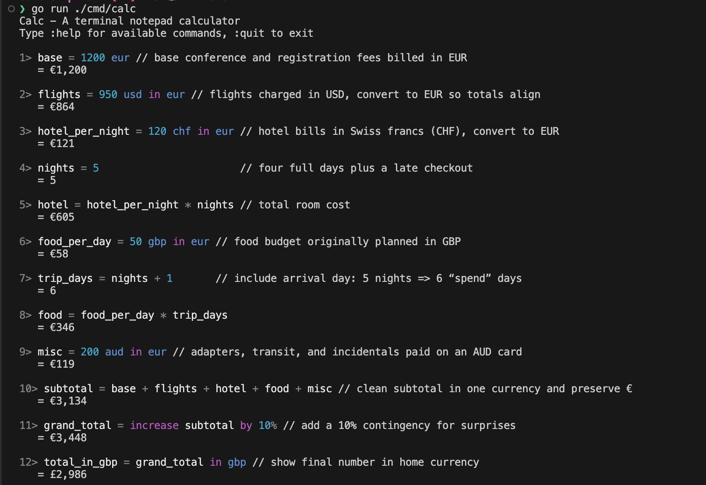
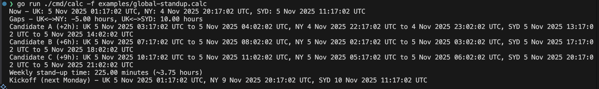

# calc

Terminal calculator with units, currency conversion, and natural language expressions. Zero dependencies, runs locally.

## Features

- Arithmetic with operator precedence and parentheses
- Named variables with dependency tracking
- Unit conversions (length, mass, time, volume, temperature, etc.)
- Currency conversion with postfix notation support
- Date and time arithmetic
- Percentage calculations
- Natural language phrases ("half of", "double", etc.)
- Built-in functions (sum, average, mean)
- REPL with command mode, syntax highlighting, and themes
- Reference previous results with `prev`, `prev~N` (relative), and `prev#N` (absolute line number) keywords
- Line comments with // (ignored by the lexer)
- Save/load workspace files from the REPL
- **Script arguments**: Pass parameters to calc scripts with `:arg` directives and `--arg` flags

## Installation

### Quick Install (Latest Release)

```bash
curl -fsSL https://raw.githubusercontent.com/AndrewNeudegg/calc/main/install.sh | sh
```

Or download manually from [releases](https://github.com/AndrewNeudegg/calc/releases).

### Build from Source

```bash
go build -o calc ./cmd/calc
./calc
```

Or run directly:
```bash
go run ./cmd/calc
```

### CLI Usage

Single calculation mode:
```bash
./calc -c "12 gbp in dollars"
```

Execute a script file:
```bash
./calc -f examples/k8s-cluster.calc
```

Execute a script with arguments:
```bash
./calc -f examples/shopping-list.calc --arg family_members=4 --arg nights=7 --arg price_per_meal=8.50
```

Read arguments from a file:
```bash
./calc -f examples/shopping-list.calc --arg-file args.env
```

Read from stdin (use '-' as the file):
```bash
cat examples/k8s-cluster.calc | ./calc -f -
```

Show help:
```bash
./calc -h
```

## Examples

Jump in with a few ready-made scripts (open the files to see how they’re built):

- Trip budget planner: `examples/trip.calc`
- Global stand-up planner: `examples/global-standup.calc`
- Kubernetes cluster cost model: `examples/k8s-cluster.calc`
- Shopping list calculator (with arguments): `examples/shopping-list.calc`

Run them from the CLI:

```bash
./calc -f examples/trip.calc
./calc -f examples/global-standup.calc
./calc -f examples/k8s-cluster.calc
./calc -f examples/shopping-list.calc --arg family_members=4 --arg nights=7 --arg price_per_meal=8.50
```

Trip example (screenshot):



Global stand-up example (screenshot):



## Quick Reference

### Operators

| Operator | Description | Example | Result |
|----------|-------------|---------|--------|
| `+` | Addition | `5 + 3` | `8.00` |
| `-` | Subtraction | `10 - 4` | `6.00` |
| `*` | Multiplication | `6 * 7` | `42.00` |
| `/` | Division | `20 / 4` | `5.00` |
| `%` | Percentage | `20%` | `0.20` |
| `=` | Assignment | `x = 10` | `10.00` |
| `in` | Unit conversion | `10 m in cm` | `1,000.00 cm` |

### Currency Formats

| Format | Example | Display |
|--------|---------|---------|
| Symbol prefix | `£12`, `$50`, `€100`, `¥1000` | Currency symbol shown |
| Code postfix | `12 gbp`, `50 usd`, `100 eur` | Converted to symbol |
| Name postfix | `50 dollars`, `25 euros`, `1000 yen` | Converted to symbol |

Supported: USD ($), GBP (£), EUR (€), JPY (¥), and many more codes including: AUD, CAD, NZD, CHF, CNY, HKD, SGD, INR, KRW, TWD, SEK, NOK, DKK, TRY, RUB, PLN, CZK, HUF, RON, ILS, AED, SAR, THB, MYR, IDR, PHP, ZAR, MXN, BRL

**Note:** "pound" and "pounds" refer to weight (lb). Use "gbp" or "£" for currency.

### Number Formats

The calculator supports both UK and European number formats. The format is determined by the `:set locale` setting.

**Default:** UK format (`en_GB`) - comma as thousand separator, period as decimal

| Format | Description | Example Input | Parsed Value | Locale |
|--------|-------------|---------------|--------------|--------|
| UK Format | Comma as thousand separator, period as decimal | `1,234.56` | 1234.56 | `en_GB`, `en_US` |
| European Format | Period as thousand separator, comma as decimal | `1.234,56` | 1234.56 | `de_DE`, `fr_FR`, etc. |
| Large numbers | Multiple thousand separators | `12,345,678.90` | 12345678.90 | `en_GB` |
| Currency with format | Works with all currency symbols | `$55,101.10` | $55,101.10 | `en_GB` |
| European currency | European format with Euro | `€65.342,10` | €65,342.10 | `de_DE` |

#### Setting Number Format Locale

Use `:set locale <code>` to change how numbers are parsed:

```
:set locale en_GB    # UK/US format: 1,234.56 (default)
:set locale en_US    # UK/US format: 1,234.56
:set locale de_DE    # German format: 1.234,56
:set locale fr_FR    # French format: 1.234,56
:set locale es_ES    # Spanish format: 1.234,56
```

Examples:
```
1> $31,432
   = $31,432.00

2> half of $31,432
   = $15,716.00

3> :set locale de_DE
   Locale set to de_DE

4> €65.342,10
   = €65,342.10

5> :set locale en_GB
   Locale set to en_GB

6> 2.115 / 2
   = 1.06

7> 1,500,000 + 500,000
   = 2,000,000.00
```

**Note:** Numbers with many decimal places (like `2.115` or `3.14159`) are correctly interpreted as decimals in UK format, not as thousands. Use `:set locale` to explicitly control the number format when working with European-style numbers.

### Time Format

Times in `HH:MM` format are recognized automatically:

| Expression | Result |
|------------|--------|
| `14:00 + 2` | `16:00` |
| `11:00 - 09:00` | `02:00` |
| `17:45 - 09:30` | `08:15` |

### Natural Language

| Phrase | Example | Result |
|--------|---------|--------|
| `half of` | `half of 100` | `50.00` |
| `double` | `double 25` | `50.00` |
| `three quarters of` | `three quarters of 80` | `60.00` |
| `X% of Y` | `20% of 50` | `10.00` |
| `increase X by Y%` | `increase 100 by 10%` | `110.00` |
| `decrease X by Y%` | `decrease 100 by 10%` | `90.00` |
| `X is what % of Y` | `20 is what % of 50` | `40.00%` |

### Functions

| Function | Description | Example |
|----------|-------------|---------|
| `sum(...)` | Sum of all arguments | `sum(10, 20, 30)` → `60.00` |
| `average(...)` | Average of arguments | `average(10, 20, 30)` → `20.00` |
| `mean(...)` | Alias for average | `mean(5, 10, 15)` → `10.00` |
| `min(...)` | Minimum of arguments | `min(3, 7, 2, 9)` → `2.00` |
| `max(...)` | Maximum of arguments | `max(3, 7, 2, 9)` → `9.00` |
| `print("...")` | Interpolate `{var}` placeholders and return the string | `tt = 55` then `print("foo: {tt}")` → `foo: 55` |

Notes:
- Function arguments can be expressions.
- `sum()` with no arguments returns `0`.
- `average()` requires at least one argument; calling it with none is an error.
- `min()`/`max()` require at least one argument; calling either with none is an error.
- Functions return plain numbers. If you need to preserve units or currency, convert to a common unit first or use explicit operators (e.g., `a + b` instead of `sum(a, b)`).

### Strings and Print

- String literals are written with double quotes: `"hello world"`.
- Use `print("...")` to interpolate variables inside `{}` and produce a string result that is printed by the REPL/CLI:

```
1> tt = 55
   = 55.00
2> print("foo bar: {tt}, foo bar")
   = foo bar: 55, foo bar
```

Notes:
- Placeholders must be simple variable names, e.g., `{rate}`, `{total_cost}`.
- If a placeholder variable is undefined, `print` returns an error.
- Interpolated values use sensible defaults for formatting; date/time values render in a readable form.

### Date Keywords

| Keyword | Description |
|---------|-------------|
| `now` | Current date/time |
| `today` | Current date |
| `tomorrow` | Today + 1 day |
| `yesterday` | Today - 1 day |
| `next week` | Today + 7 days |
| `last week` | Today - 7 days |
| `next month` | Today + 30 days |

Also supported in date arithmetic: smaller units including hours, minutes, and seconds (e.g., `today + 3 days + 2 hours`).

### Previous Result Keywords

Reference the output of previous REPL commands using the `prev` keyword:

| Keyword | Description | Example |
|---------|-------------|---------|
| `prev` | Most recent result | `5 * 5` → `25.00`<br>`10 + prev` → `35.00` |
| `prev~` or `prev~1` | Result before last (relative) | `10` → `10.00`<br>`20` → `20.00`<br>`prev~1` → `10.00` |
| `prev~N` | Result N steps back (relative) | `prev~5` references the result 5 commands ago |
| `prev#N` | Result at line N (absolute) | `prev#15` references the result at line 15 |

Examples:
```
1> 5 * 5
   = 25.00

2> 10 + prev
   = 35.00

3> T = 30 / 5
   = 6.00

4> T
   = 6.00

5> prev
   = 6.00

6> prev~2
   = 35.00

7> prev#1
   = 25.00
```

Using absolute line references:
```
9> 10
   = 10.00

10> 11
   = 11.00

11> 12
   = 12.00

12> 13
   = 13.00

13> prev~3
   = 10.00

14> prev~4 + 10
   = 20.00

15> prev~4 * 10
   = 110.00

16> prev#15 * 42
   = 4,620.00
```

Notes:
- `prev` references work with all value types (numbers, currency, units, dates, etc.)
- You can use multiple `prev` references in a single expression: `prev + prev~1` or `prev#15 + prev~2`
- `prev~N` uses relative offsets (N steps back from current line)
- `prev#N` uses absolute line numbers (references line N exactly)
- Attempting to reference a non-existent result (e.g., `prev` on the first line) will produce an error
- `prev` is only available in REPL mode, not in single-calculation mode (`-c`) or file execution mode (`-f`)

### REPL Commands

| Command | Description |
|---------|-------------|
| `:help` | Show available commands |
| `:save <file>` | Save current workspace to the current directory |
| `:open <file>` | Open a workspace file and restore variables |
| `:set <key> <value>` | Update a preference (see below) |
| `:clear` | Clear screen and reset current session |
| `:quit` / `:exit` / `:q` | Exit |
| `:tz list` | List available timezones |
| `:quiet [on/off]` | Toggle or set quiet mode (suppress assignment output) |

Settings keys for `:set`:
- `precision <n>` – Number of decimal places (default: 2)
- `dateformat <fmt>` – Date format string (default: `2 Jan 2006`)
- `currency <CODE>` – Default currency code (GBP, USD, EUR, JPY)
- `locale <locale>` – Locale for formatting (default: `en_GB`)
- `fuzzy <on|off>` – Enable/disable natural-language parsing
- `autocomplete <on|off>` – Enable/disable autocomplete suggestions (default: on)

### Autocomplete

The REPL includes intelligent autocomplete to help you quickly reuse variables, commands, functions, units, and currencies:

**Triggering autocomplete:**
- Press **Tab** to see suggestions and cycle forward through them
- Press **Shift+Tab** to cycle backward through suggestions
- Press **Enter** or **Tab** to accept the current suggestion
- Press **Esc** to cancel and dismiss suggestions

**What gets suggested:**
- **Commands:** Type `:` followed by letters to see matching commands (`:help`, `:save`, `:set`, etc.)
- **Variables:** Previously defined variable names appear as you type
- **Functions:** Built-in functions like `sum`, `average`, `mean`, `min`, `max`, `print`
- **Units:** Common units like `km`, `kg`, `m`, `cm`, `l`, etc.
- **Currencies:** Currency codes like `usd`, `gbp`, `eur`, `jpy`
- **Keywords:** Date keywords (`now`, `today`, `tomorrow`) and fuzzy phrases (`half of`, `double`) when fuzzy mode is enabled

**Examples:**
```
1> :s<Tab>       # Suggests :save and :set
2> my<Tab>       # Suggests any variables starting with "my"
3> su<Tab>       # Suggests sum( function
4> 10 k<Tab>     # Suggests km, kg, and other units starting with k
5> 50 us<Tab>    # Suggests usd currency
```

**Note:** Autocomplete can be disabled with `:set autocomplete off` if preferred.

Tips:
- Press Ctrl-C to cancel the current input line.
- Press Ctrl-D to exit (same as `:quit`).
- Type `:help` any time to see the command summary.

Notes on saving:
- `:save <file>` writes a plain-text workspace file in your current working directory. Only expressions are saved (commands are skipped).
- Preferences are stored separately at `~/.config/calc/settings.json` and are also saved when you run `:save`.

### Quiet mode

Use `:quiet on` to suppress automatic printing of assignment results. This is handy in scripts so only your `print("...")` lines appear in the output.

Example at the top of a script:

```
:set precision 0
:set dateformat Mon 2 Jan 2006
:quiet on
```

### Comments

Use `//` for line comments. Everything after `//` on a line is ignored:

```
x = 10 // hourly rate
rate = 2.5 // per hour
```

### Script Arguments

Calc scripts support parameterization through the `:arg` directive, allowing you to create reusable calculations that accept input values.

#### Declaring Arguments

Use the `:arg` directive in your script to declare parameters:

```
:arg var_name "Prompt text (optional)"
```

Examples:
```
:arg count
:arg price "What is the price per item?"
:arg distance "Enter distance:"
```

#### Passing Arguments

Pass arguments via the command line using `--arg` or `-a`:

```bash
./calc -f script.calc --arg count=5 --arg price=10.50
./calc -f script.calc -a count=5 -a price=10.50
```

#### Rich Input Support

Argument values support the full calc expression syntax, including:
- Numbers: `--arg count=5`
- Units: `--arg distance="100 km"`
- Currency: `--arg price="50 usd"`
- Expressions: `--arg value="5*3"`

#### Argument Files

For multiple arguments, use an argument file (`.env` style):

```bash
# args.env
family_members=4
nights=7
price_per_meal=8.50
```

Then reference it with `--arg-file`:

```bash
./calc -f script.calc --arg-file args.env
```

CLI arguments override file arguments:
```bash
./calc -f script.calc --arg-file args.env --arg nights=10
```

#### Interactive Prompts

When an argument is declared but not provided, calc prompts for it interactively:

```bash
$ ./calc -f script.calc
How many family members? 4
How many nights? 7
...
```

#### Example Script

See `examples/shopping-list.calc` for a complete example:

```
:arg family_members "How many family members?"
:arg nights "How many nights are you cooking dinner?"
:arg price_per_meal "What's the average cost per meal per person (in dollars)?"

total_meals = family_members * nights
total_cost = total_meals * price_per_meal usd

print("Total cost: {total_cost}")
```

Run with:
```bash
./calc -f examples/shopping-list.calc --arg family_members=4 --arg nights=7 --arg price_per_meal=8.50
```

## Supported Units

### Length

| Unit | Aliases | Symbol |
|------|---------|--------|
| metre | meter, metres, meters | m |
| centimetre | centimeter, centimetres, centimeters | cm |
| millimetre | millimeter, millimetres, millimeters | mm |
| kilometre | kilometer, kilometres, kilometers | km |
| foot | feet | ft |
| inch | inches | in |
| yard | yards | yd |
| mile | miles | mi |

### Mass

| Unit | Aliases | Symbol |
|------|---------|--------|
| kilogram | kilograms | kg |
| gram | grams | g |
| milligram | milligrams | mg |
| microgram | micrograms | µg, ug |
| pound | pounds | lb, lbs |
| ounce | ounces | oz |
| stone | stones | st |
| carat | carats | ct |
| tonne | tonnes, ton, tons | - |

### Time

| Unit | Aliases | Symbol |
|------|---------|--------|
| nanosecond | nanoseconds | ns |
| microsecond | microseconds | µs, us |
| millisecond | milliseconds | ms |
| second | seconds, sec | s |
| minute | minutes | min |
| hour | hours | h, hr |
| day | days | - |
| week | weeks | - |
| fortnight | fortnights | - |
| month | months | - |
| quarter | quarters | - |
| semester | semesters | - |
| year | years | - |

### Volume

| Unit | Aliases | Symbol |
|------|---------|--------|
| litre | liter, litres, liters | l |
| millilitre | milliliter, millilitres, milliliters | ml |
| centilitre | centiliter, centilitres, centiliters | cl |
| decilitre | deciliter, decilitres, deciliters | dl |
| gallon | gallons | gal |
| US gallon | usgallon, usgallons | usgal |
| UK gallon | ukgallon, ukgallons, imperialgallon | ukgal, impgal |
| quart | quarts | qt |
| pint | pints | pt |
| cup | cups | - |
| fluid ounce | fluidounce, fluidounces | floz |
| tablespoon | tablespoons | tbsp |
| teaspoon | teaspoons | tsp |

### Temperature

| Unit | Aliases | Symbol |
|------|---------|--------|
| celsius | - | c, °c |
| fahrenheit | - | f, °f |
| kelvin | - | k |
| rankine | - | r, °r |

### Speed

| Unit | Description | Symbol |
|------|-------------|--------|
| metres per second | - | mps |
| kilometres per hour | - | kph, kmh |
| miles per hour | - | mph |
| feet per second | - | fps |
| knot | knots | kn |

### Area

| Unit | Aliases | Symbol |
|------|---------|--------|
| square metre | squaremeter, squaremetres, squaremeters | sqm, m², m2 |
| square kilometre | squarekilometer, squarekilometres, squarekilometers | sqkm, km², km2 |
| square centimetre | squarecentimeter, squarecentimetres, squarecentimeters | sqcm, cm², cm2 |
| square millimetre | squaremillimeter, squaremillimetres, squaremillimeters | sqmm, mm², mm2 |
| square foot | squarefoot, squarefeet | sqft, ft², ft2 |
| square inch | squareinch, squareinches | sqin, in², in2 |
| square yard | squareyard, squareyards | sqyd, yd², yd2 |
| square mile | squaremile, squaremiles | sqmi, mi², mi2 |
| acre | acres | - |
| hectare | hectares | ha |

### Pressure

| Unit | Aliases | Symbol |
|------|---------|--------|
| pascal | pascals | pa |
| kilopascal | kilopascals | kpa |
| megapascal | megapascals | mpa |
| bar | bars | - |
| millibar | millibars | mbar |
| atmosphere | atmospheres | atm |
| pound per square inch | - | psi |
| torr | - | - |
| millimetres of mercury | - | mmhg |
| inches of mercury | - | inhg |

### Force

| Unit | Aliases | Symbol |
|------|---------|--------|
| newton | newtons | n |
| kilonewton | kilonewtons | kn |
| meganewton | meganewtons | mn |
| pound force | poundsforce | lbf |
| kilogram force | - | kgf |
| dyne | dynes | - |

### Angle

| Unit | Aliases | Symbol |
|------|---------|--------|
| degree | degrees | deg, ° |
| radian | radians | rad |
| gradian | gradians | grad, gon |
| turn | turns, revolution, revolutions | - |

### Frequency

| Unit | Aliases | Symbol |
|------|---------|--------|
| hertz | - | hz |
| kilohertz | - | khz |
| megahertz | - | mhz |
| gigahertz | - | ghz |
| terahertz | - | thz |
| revolutions per minute | - | rpm |

### Data Storage (Bytes)

| Unit | Aliases | Symbol |
|------|---------|--------|
| byte | bytes | b |
| kilobyte | kilobytes | kb |
| megabyte | megabytes | mb |
| gigabyte | gigabytes | gb |
| terabyte | terabytes | tb |
| petabyte | petabytes | pb |

### Data Storage (Bits)

| Unit | Aliases | Symbol |
|------|---------|--------|
| bit | bits | - |
| kilobit | kilobits | kbit |
| megabit | megabits | mbit |
| gigabit | gigabits | gbit |
| terabit | terabits | tbit |
| petabit | petabits | pbit |

### Data Rate

| Unit | Description |
|------|-------------|
| bps, kbps, mbps, gbps, tbps | Bits per second |
| Bps, KBps, MBps, GBps, TBps | Bytes per second |


## Examples

### Basic Arithmetic
```
1> 3 + 4 * 5
   = 23.00

2> (10 + 5) / 2
   = 7.50
```

### Variables
```
3> hourly = £23.50
   = £23.50

4> weekly = hourly * 37.5
   = £881.25
```

### Unit Conversions
```
5> 10 m in cm
   = 1,000.00 cm

6> 100 km in miles
   = 62.14 miles

7> 70 kg in lb
   = 154.32 lb
```

### Currency
```
8> £120 + $30
   = £143.50

9> $50 in GBP
   = £39.50

10> 12 gbp in dollars
   = $15.24

11> 100 usd in euros
   = €90.91

12> 50 dollars + 25 euros
   = $77.50
```

Note: Currency can be written with symbols (£, $, €, ¥) before the number, or with codes/names (gbp, usd, dollars, euros, yen) after the number.

### Percentages
```
13> 30 + 20%
   = 36.00

11> 20% of 50
   = 10.00

12> increase 100 by 10%
   = 110.00

13> 20 is what % of 50
   = 40.00%
```

### Fuzzy Phrases
```
14> half of 80
   = 40.00

15> double 15
   = 30.00

16> three quarters of 200
   = 150.00
```

### Fuzzy Phrases with Variables
Fuzzy phrases work seamlessly with variables and assignments:

```
17> fo = half of 99
   = 49.50

18> half of fo
   = 24.75

19> result = double fo
   = 99.00

20> x = 100
   = 100.00

21> y = half of x
   = 50.00

22> z = double y
   = 100.00
```

### Time Arithmetic
Times in `HH:MM` format are recognised and maintain their format through calculations:

```
23> 11:00 - 09:00
   = 02:00

24> 14:00 + 2
   = 16:00

25> start = 09:30
   = 09:30

26> end = 17:45
   = 17:45

27> end - start
   = 08:15

28> meeting = start + 2
   = 11:30
```

Times are stored as time units and displayed in `HH:MM` format. You can add or subtract hours (as numbers) or other times.

## Testing

```bash
# Run all tests
go test ./...

# With race detection
go test ./... -race

# With coverage
go test ./... -cover
```

## Releases

To create a new release:
```bash
git tag v0.1.0
git push origin v0.1.0
```

Binaries are built automatically for:
- Linux (amd64, arm64)
- macOS (amd64, arm64)

The install script downloads the appropriate binary for your platform.

## License

This project is licensed under the MIT License. See the `LICENSE` file for details.
